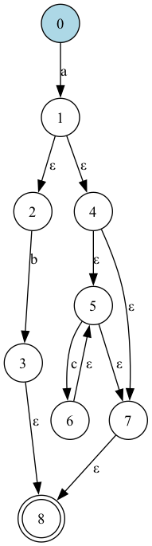

# Automate Visualization


Automate Visualization is a tool that facilitates the visualization of automata transformations. It converts regular expressions into nondeterministic finite automata (NFA) and then minimizes them to deterministic finite automata (DFA). This tool is useful for understanding the behavior of regular expressions and their corresponding automata.

## Features

- Convert regular expressions to NFA
- Minimize NFA to DFA
- Visualize automata using Graphviz

## Installation

### Prerequisites

- Java Development Kit (JDK) 8 or higher
- Maven
- Graphviz

### Steps

1. Clone the repository:

   ```bash
   git clone https://github.com/abdokin/automate-visualization.git
   ```

2. Navigate to the project directory:

   ```bash
   cd automate-visualization
   ```

3. Compile the project:

   ```bash
   mvn compile
   ```

4. Generate the JAR file:

   ```bash
   mvn package
   ```

5. Run The project:

   ```bash
   java -jar target/automate-1.0.jar "a|(bc) *k"
   ```

6. View the generated visualization by opening the `afn.png` and `dfa.png` file. Use any image viewer on your system to open and inspect the automaton visualization.

## Example

Below is an example of the generated visualization for the provided regex `a|(bc)*k`:


## License

This project is licensed under the MIT License - see the [LICENSE](LICENSE) file for details.
